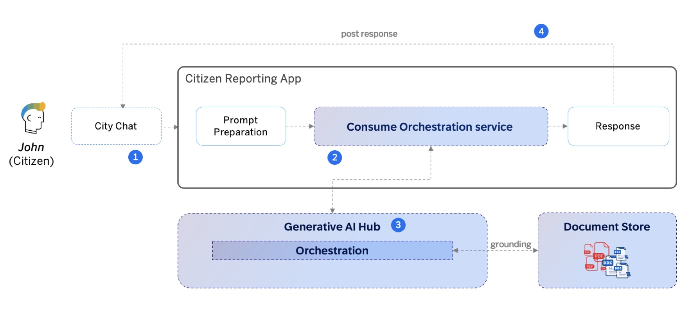
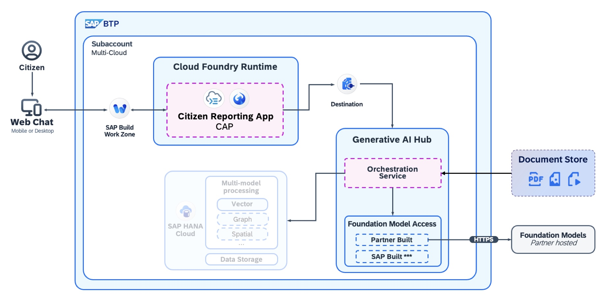

# BTP CAP Chatbot sample(City Chat) powered by Orchestration Service of SAP Generative AI Hub
<!--- Register repository https://api.reuse.software/register, then add REUSE badge:

-->
The CAP sample demonstrates how to use [Orchestration Service](https://help.sap.com/docs/ai-launchpad/sap-ai-launchpad/orchestration) through [@sap-ai-sdk/orchestration](https://www.npmjs.com/package/@sap-ai-sdk/orchestration) to streamline and orchestrate the workflow of Large Language Model (LLM) in SAP Generative AI Hub in Business Application Development with enhanced security and data privacy, such as Prompt Templating, Grounding, Data Masking, Content Filter etc.

## Overview
### Use Case
This sample extends the original [citizen reporting](../01-social-media-citizen-reporting-genai-hub) use case with a chatbot interface for citizen to ask anything about public services and policies to a custom knowledge base of the city council of a fictitious city named <b>Sagenai City</b>, such as marriage registration, birth registration, building licenses, etc.

### Solution Architecture
This version of citizen reporting app is developed with SAP Cloud Application Program Model(CAP) in TypeScript as a full-stack application, integrated with Orchestration Service through [@sap-ai-sdk/orchestration](https://www.npmjs.com/package/@sap-ai-sdk/orchestration). Its chat user interface is implemented with SAP UI5 free style application, deployed and accessed through SAP Build Work Zone on SAP BTP for production

## Download and Installation
Please follow the manual [here](cap-chatbot/src/README.md) to download, install and run this sample.

## Known Issues
None.

## How to obtain support
[Create an issue](https://github.com/SAP-samples/<repository-name>/issues) in this repository if you find a bug or have questions about the content.
 
For additional support, [ask a question in SAP Community](https://answers.sap.com/questions/ask.html).

## Contributing
If you wish to contribute code, offer fixes or improvements, please send a pull request. Due to legal reasons, contributors will be asked to accept a DCO when they create the first pull request to this project. This happens in an automated fashion during the submission process. SAP uses [the standard DCO text of the Linux Foundation](https://developercertificate.org/).

## License
Copyright (c) 2024 SAP SE or an SAP affiliate company. All rights reserved. This project is licensed under the Apache Software License, version 2.0 except as noted otherwise in the [LICENSE](../LICENSES/Apache-2.0.txt) file.
