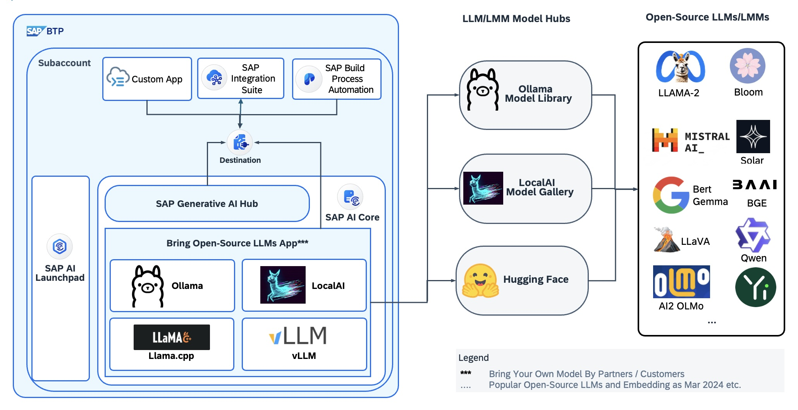

# Bringing Open-sourced LLMs into SAP AI Core

The open-source community surrounding Large Language Models (LLMs) is evolving rapidly, with new models, backends, libraries, and toolings constantly emerging. These developments enable the running of LLMs locally or on self-hosted environments. SAP AI Core is a service in the SAP Business Technology Platform that is designed to handle the execution and operations of your AI assets in a standardized, scalable, and hyperscaler-agnostic way. This repository serves as a guide on how to bring popular open-source Large Language Models (such as LLaMa 3, Phi-3, Mistral, Mixtral, LlaVA, Gemma, etc.) and open-source Text Embedding Models into SAP AI Core using widely adopted open-source LLM tools or backends, which complements SAP Generative AI Hub with self-hosted open-source LLMs.

- [Ollama](https://ollama.com/)
- [LocalAI](https://localai.io/)
- [llama.cpp](https://github.com/ggerganov/llama.cpp/tree/master/examples/server)
- [vLLM](https://docs.vllm.ai)
- [Custom Inference Server](byom-oss-llm-code/transformer) with [Hugging Face Transformers Library](https://huggingface.co/docs/transformers/en/index)
- [Infinity](https://github.com/michaelfeil/infinity) for open-source text embedding models from [Massive Text Embedding Benchmark (MTEB)](https://huggingface.co/spaces/mteb/leaderboard)
<br/>

Please refer to the blog post about [**Bring Open-Source LLMs into SAP AI Core**](https://community.sap.com/t5/artificial-intelligence-and-machine-learning-blogs/bring-open-source-llms-into-sap-ai-core/ba-p/13655167) for details.

## Why running open-sourced LLMs with SAP AI Core?

- Data Protection & Privacy
- Security
- Cost-effectiveness
- Flexibility of choices for LLMs and LLM backends etc.
- Making open-sourced LLMs enterprise ready

## Solution Architecture


In principle, there are three essential parts for bringing an open-source LLM/LMM into SAP AI Core.

- Commercially viable Open-Source or Open-Weight Models: e.g. Mistral, Mixtral, LLaVa etc.
- Public accessible Model Hub: For instance, [Ollama Model Library](https://ollama.com/library) tailored for Ollama, [Hugging Face](https://huggingface.co/) as a general purposed model repository.
- Inference server in SAP AI Core: You can bring your own code to implement an inference server, for example,[Custom Inference Server](byom-oss-llm-code/transformer) with [Hugging Face Transformers Library](https://huggingface.co/docs/transformers/en/index). Alternatively, there are open-source and ready-to-use llm inference servers which can be reused in SAP AI Core, like Ollama, LocalAI, llama.cpp and vLLM with minimal custom code as a custom Dockerfile and configurable serving template adapted for SAP AI Core. Ollama is recommended for its simplicity and efficiency.

## Why leverage Ollama, LocalAI, llama.cpp and vLLM in SAP AI Core?

Ollama, LocalAI, llama.cpp and vLLM offer a comprehensive solution for running Large Language Models (LLMs) locally or in self-hosted environments. Their full stack capabilities include:

- Model Management: Dynamically pull or download LLMs from model repository through API during run-time (exclusive to Ollama and LocalAI. vLLM provides seamless integration with Hugging Face models)
- Running LLM efficiently with GPU Acceleration in SAP AI Core using open-source backends such as llama.cpp, vllm, transformer, exllama etc.
- Serving with OpenAI-compatible chat completions and embedding APIs.
- Easy deployment and setup without the need of without the need for custom code deployment in SAP AI Core.
- Commercially viability: They are all under MIT licenses or Apache 2.0 License.
<br/>

<style>
table {
    width: 100%;
}

td:nth-child(1) {
    width: 20%;
}

td:nth-child(2),
td:nth-child(3) {
    width: 40%;
}
</style>

### Ollama vs LocalAI in context of SAP AI Core

|                                     | <a href="https://ollama.com"><br/>Ollama</a>  | <a href="https://localai.io/"><br/>LocalAI</a> |
|-------------------------------------|--------------------------------------------|-------------------------------------|
| Description                         |     "Ollama: Get up and running with Llama 2, Mistral, Gemma, and other large language models."                                                                   | "LocalAI is the free, Open Source OpenAI alternative. LocalAI act as a drop-in replacement REST API that’s compatible with OpenAI API specifications for local inference..." |
| Recommendation                     |     Recommended if just inference LLMs/LMMs in SAP AI Core. See its AI capabilities below for detail.       |  Recommended if speech recognition, speech generation and image generation are also required apart from LLMs/LMMs. |
| AI Capabilities                     |     -Text generation<br/> -Vision<br/> -Text Embedding   | -Text generation<br/> -Vision<br/>  -Text Embedding<br/> -Speech to Text<br/> -Text to Speech<br/> -Image Generation |
| Installation & Setup                |    Easy installation and setup   | Assure to use the corresponding docker image or build with the right variables for GPU acceleration. |
| GPU Acceleration                    |    Automatically detect and apply GPU   | Supported. Require configuration on model |
| Model Management                    |    Easy built-in model management through CLI command or APIs   | [Experimental model gallery](https://localai.io/models/)<br/> May require additional configuration for GPU acceleration per model |
| Supported Backends                  |    llama.cpp   | multi-backend support and backend agnostic. Default backend as llama.cpp, also support extra backends such as vLLM, rwkv, huggingface transformer, bert, whisper.cpp etc. Please check its [model compatibility table](https://localai.io/model-compatibility/) for details  |
| Supported Models                    |     [Built-in Model Library](https://ollama.com/library)   | [Experimental Model Gallery](https://localai.io/models/) |
| Model Switching                     |    Seamless model switching with automatic memory management   | Supported |
| APIs                                |    -Model Management API</br>-OpenAI-compatible chat/complemtions API<br/>-Embedding API    | -Model Management API<br/>-Text Generation API</br>-OpenAI-compatible chat/complemtions API<br/>-Embedding API |
| Model Customization                 |    supported   |  supported  |
| License                              |    MIT   |     MIT |
<br/>

### llama.cpp vs vLLM in context of SAP AI Core

|                                     | <a href="https://github.com/ggerganov/llama.cpp"><br/>llama.cpp</a>  | <a href="https://docs.vllm.ai/"><br/>vLLM</a> |
|-------------------------------------|--------------------------------------------|-------------------------------------|
| Description                         | "The main goal of llama.cpp is to enable LLM inference with minimal setup and state-of-the-art performance on a wide variety of hardware - locally and in the cloud." | "A high-throughput and memory-efficient inference and serving engine for LLMs" |
| Recommendation                     |     Recommended for private custom LLMs or fine tuning model.       |  Recommended for private custom LLMs or fine tuning models. |
| AI Capabilities                     |     -Text generation<br/> -Vision<br/> -Text Embedding   | -Text generation<br/> -Vision<br/>  -Text Embedding<br/> |
| Deployment & Setup                  |    Easy deployment via docker. Many [arguments](https://github.com/ggerganov/llama.cpp/tree/master/examples/server) to explore on starting llama.cpp server  | Easy deployment via docker. Many [engine arguments](https://docs.vllm.ai/en/latest/models/engine_args.html) on starting vllm.entrypoints.openai.api_server  |
| GPU Acceleration                    |    Supported   |  Supported  |
| Model Management                    |    Not supported. Need external tool(wget etc) to download models from Hugging Face  | Seamless integration with popular HuggingFace models |
| Supported Quantization                  |    1.5-bit, 2-bit, 3-bit, 4-bit, 5-bit, 6-bit, and 8-bit integer quantization   | GPTQ, AWQ, SqueezeLLM, FP8 KV Cache  |
| Supported Models                    |     <https://github.com/ggerganov/llama.cpp> > Supported models   | [Supported Model](https://docs.vllm.ai/en/latest/models/supported_models.html) |
| Model Switching                     |    Not supported. One deployment for one model.   | Not supported. One deployment for one model.  |
| APIs                                |    -OpenAI-compatible chat/complemtions API<br/>-Embedding API    | -OpenAI-compatible chat/complemtions API<br/>-Embedding API<br/> |
| License                   |    MIT  | Apache-2.0 license |

## How to bring open-sourced LLMs into SAP AI Core

In the following section, we see how to bring open-sourced LLMs into SAP AI Core with Ollama, LocalAI, llama.cpp and vLLM.

### Prerequisites

The following softwares are required to serve an AI model in SAP AI Core. Please follow [this tutorial](https://developers.sap.com/group.ai-core-get-started-basics.html) to provision and set up your own SAP AI Core if it is new to you, which will cover the list below.

#### 1. [Use Boosters for Standard Plan of SAP AI Core and SAP AI Launchpad(Optional)](https://developers.sap.com/group.ai-core-get-started-basics.html)

Important: Please assure to entitle **Standard Plan** or **Extended Plan** of SAP AI Core, which require a BTPEA, or Pay-As-You-Go contract. Please refer to [pricing of SAP AI Core](https://discovery-center.cloud.sap/serviceCatalog/sap-ai-core?region=all&tab=service_plan) for detail. Due to restriction of Free Tier service plan. We can't run the open-source llms with Free Tier plan. Please refer to the official document about [Resource Plan in SAP AI Core](https://help.sap.com/docs/sap-ai-core/sap-ai-core-service-guide/choose-resource-plan-c58d4e584a5b40a2992265beb9b6be3c) for detail.<br/>

For the Free Tier service plan, only the Starter resource plan is available. Specifying other plans will result in error. For the Standard service plan, all resource plans are available. For more information, see Free Tier and Service Plans.<br/>

In this sample, SAP AI Launchpad is optional, and only used to show and check the results. All the configurations like create resource group, docker registry secret, github repo onboarding, application, configuration and deployment etc. are automated through SAP AI Core SDK. However, it is still recommended to have SAP AI Launchpad for more user-friendly graphical cockpit to perform administration tasks, especially if you are new to SAP AI Core.

#### 2. [Set Up Tools to Connect With and Operate SAP AI Core](https://developers.sap.com/tutorials/ai-core-setup.html)

Please skip if you have previously completed the initial configurations for your SAP AI Core.

#### 3. [Generate a GitHub personal access token](https://developers.sap.com/tutorials/ai-core-helloworld.html)

Please skip if you have done it before.<br>
Only take the steps about Generate a GitHub personal access token, which will be used to onboard the github repository into SAP AI Core afterwards.

#### 4. Install Docker Desktop and create a personal Docker Registry

Please skip if you have done it before.<br>
Instructions can be found [here](https://docs.docker.com/docker-hub/quickstart/), Step 1 to 4.
We recommend you to create an access token to be used in place of your password. Instructions on how to generate a token can be found [here](https://docs.docker.com/docker-hub/access-tokens/#create-an-access-token).

#### 5. Install Git and Visual Studio Code(Optional)

- **Install Git** by following the instructions [here](https://github.com/git-guides/install-git).
- Download and Install Visual Studio Code by following instructions [here](https://code.visualstudio.com/)

#### 6.Fork [the GitHub repository of btp-generative-ai-hub-use-cases](https://github.com/SAP-samples/btp-generative-ai-hub-use-cases)

Fork with [this url](https://github.com/SAP-samples/btp-generative-ai-hub-use-cases/fork) into your own github account. Set your forked repository to **private** to prevent from public access.  

#### 7.Clone your forked repository

```sh
git clone <YOUR_FORKED_REPOSITORY_URL> 
```

#### 8.Setup a local Python3 environment

- **Download and Install Python3(>=3.7)** in your local environment from [here](https://www.python.org/downloads/) or other approaches.
- Create a virtual environment and install the dependencies

```sh
# Create a virtual env and install the dependencies 
cd btp-generative-ai-hub-use-cases/10-byom-oss-llm-ai-core
python3 -m venv oss-llm-env
source oss-llm-env/bin/activate
pip3 install -r byom-oss-llm-code/requirements.txt
```

### Perform the initial configurations for byom-oss-llm-ai-core application in SAP AI Core

Please follow and run the jupyter notebook [00-init-config.ipynb](byom-oss-llm-code/00-init-config.ipynb) to perform the initial configurations for byom-oss-llm-ai-core application in SAP AI Core. To run the jupyter notebook, you can use either of the options below

- [JupyterLab](https://jupyterlab.readthedocs.io/en/latest/getting_started/starting.html)

```sh
# Start the JupyterLab
jupyter lab
```

- [Visual Studio Code](https://code.visualstudio.com/docs/datascience/jupyter-notebooks)

### Option 1: (Recommended) Bring open-sourced LLMs into SAP AI Core with Ollama

Please refer to this [blog post](https://community.sap.com/t5/artificial-intelligence-and-machine-learning-blogs/bring-open-source-llms-into-sap-ai-core-with-ollama/ba-p/13659769) about Bring Open-Source LLMs into SAP AI Core with **Ollama** for more details. <br/><br/>
Please follow the jupyter notebooks below to deploy and test **Ollama** in SAP AI Core.

- [01-deployment.ipynb](byom-oss-llm-code/ollama/01-deployment.ipynb)
- [02-ollama.ipynb](byom-oss-llm-code/ollama/02-ollama.ipynb) for testing Ollama's Model pulling API, Text Generation API, OpenAI-like Chat Completion API in SAP AI Core through direct API call.
- [02-ollama-sap-genai-hub-sdk.ipynb](byom-oss-llm-code/ollama/02-ollama-sap-genai-hub-sdk.ipynb) for testing Ollama's OpenAI-like Chat Completion API in SAP AI Core through SAP Generative AI Hub SDK and Langchain
- [03-ollama-function-call.ipynb](byom-oss-llm-code/ollama/03-ollama-function-call.ipynb) for testing **Function Calling** with Ollama on the open-weight models Meta's [llama 3.1](https://ollama.com/library/llama3.1) or Mistral's [mistral v0.3](https://ollama.com/library/mistral).
- [03-ollama-llava.ipynb](byom-oss-llm-code/ollama/03-ollama-llava.ipynb) for testing Ollama's Text Generation API on [LLaVa](https://ollama.com/library/llava) model with vision capability in SAP AI Core through direct API call.
- [04-cleanup.ipynb](byom-oss-llm-code/ollama/04-cleanup.ipynb)

### Option 2: Bring open-sourced LLMs into SAP AI Core with LocalAI

Please follow the jupyter notebooks below to deploy and test **LocalAI** in SAP AI Core.

- [01-deployment.ipynb](byom-oss-llm-code/local-ai/01-deployment.ipynb)
- [02-local-ai.ipynb](byom-oss-llm-code/local-ai/02-local-ai.ipynb)
- [03-local-ai-llava.ipynb](byom-oss-llm-code/local-ai/03-local-ai-llava.ipynb)
- [04-cleanup.ipynb](byom-oss-llm-code/local-ai/04-cleanup.ipynb)

### Option 3: Bring open-sourced LLMs into SAP AI Core with llama.cpp

Please follow the jupyter notebooks below to deploy and test **llama.cpp** in SAP AI Core.

- [01-deployment.ipynb](byom-oss-llm-code/llama.cpp/01-deployment.ipynb)
- [02-llama.cpp.ipynb](byom-oss-llm-code/llama.cpp/02-llama.cpp.ipynb)
- [04-cleanup.ipynb](byom-oss-llm-code/llama.cpp/04-cleanup.ipynb)

### Option 4: Bring open-sourced LLMs into SAP AI Core with vLLM

Please follow the jupyter notebooks below to deploy and test **vLLM** in SAP AI Core.

- [01-deployment.ipynb](byom-oss-llm-code/vllm/01-deployment.ipynb)
- [02-vllm.ipynb](byom-oss-llm-code/vllm/02-vllm.ipynb)
- [04-cleanup.ipynb](byom-oss-llm-code/vllm/04-cleanup.ipynb)

### Option 5: Bring open-sourced LLMs into SAP AI Core with a Custom Inference Server with Hugging Face Transformer Library

Please follow the jupyter notebooks below to deploy and test **Custom Transformer Server** in SAP AI Core.

- [01-deployment.ipynb](byom-oss-llm-code/transformer/01-deployment.ipynb) for building the docker image and starting a deployment
- [02-transformer-direct-api-call.ipynb](byom-oss-llm-code/transformer/02-transformer-direct-api-call.ipynb): Sample code to inference [Microsoft's Phi-3-vision-128k-instruct](https://huggingface.co/microsoft/Phi-3-vision-128k-instruct) served in [custom inference server with hugging face transformers library](app/server.py) within SAP AI Core through direct API call.
- [03-transformer-sap-genai-hub-sdk.ipynb](byom-oss-llm-code/transformer/03-transformer-sap-genai-hub-sdk.ipynb): Sample code to inference [Microsoft's Phi-3-vision-128k-instruct](https://huggingface.co/microsoft/Phi-3-vision-128k-instruct) served in [custom inference server with hugging face transformers library](app/server.py) within SAP AI Core through [SAP Generative AI Hub SDK](https://pypi.org/project/generative-ai-hub-sdk/) and LangChain.
- [04-cleanup.ipynb](byom-oss-llm-code/transformer/04-cleanup.ipynb)

## License

Copyright (c) 2024 SAP SE or an SAP affiliate company. All rights reserved. This project is licensed under the Apache Software License, version 2.0 except as noted otherwise in the [LICENSE](../LICENSE) file.