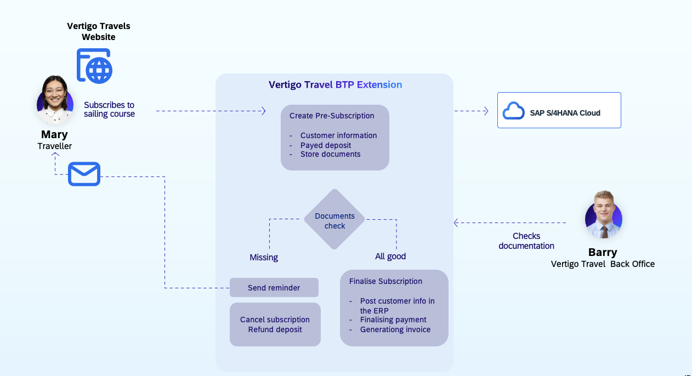
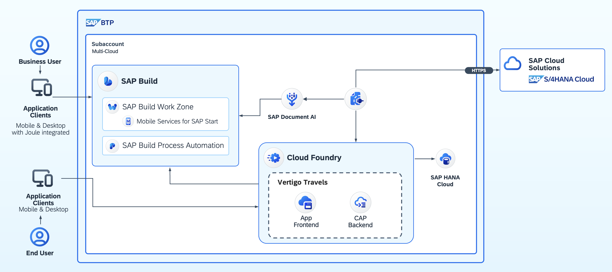

> [!NOTE]
> This documentation is currently under construction. Sections may be incomplete or subject to change.

# Vertigo Travels
### Streamline Document Processing with SAP Document AI: Jump Start Your Document Processing Use Case powered by Generative AI

This repository contains the full-stack prototype for **Vertigo Travels**, a travel agency use case built entirely on the SAP Business Technology Platform (BTP).

It serves as an end-to-end accelerator for partners and developers, demonstrating how to integrate **SAP Document AI**, **SAP Build Process Automation**, the **SAP Cloud Application Programming Model (CAP)**, and **SAP S/4HANA Cloud** into a single, cohesive application.

> [!WARNING]
> **Prototype & Support Disclaimer**
>
> This prototype serves as an inspiration for you to develop your own solution.
>
> We are not in a position to, and at our own discretion, will not maintain this repository. This version is published **as-is** without any guarantee of future updates or support.

### Table of Contents

1.  [Business Scenario](#1-business-scenario)
2.  [Solution Architecture](#2-solution-architecture)
3.  [Project Structure](#3-project-structure)
4.  [Deployment Strategy & Dependencies](#4-deployment-strategy--dependencies)

---

## 1. Business Scenario

The business process begins when a traveler, **Mary**, subscribes to a course on the Vertigo Travels website. This action triggers a BTP extension which creates a pre-subscription, collects her required documents (e.g., passport, ID card), and automatically processes them using **SAP Document AI**.

A back-office employee, **Barry**, uses a simple admin dashboard to review the *extracted data* from the documents. He can approve the subscription or, if documents are incomplete, trigger a validation workflow. If documents are missing, an **SAP Build Process Automation (BPA)** workflow is triggered to send automated email reminders to Mary.

Once Barry approves, the system automatically creates a Business Partner and Sales Order in **SAP S/4HANA Cloud**, finalizing the booking and payment process.

## 2. Solution Architecture

This solution is composed of several microservices and applications running on BTP. The frontend is a simple Node.js application that serves a static HTML page and acts as a proxy. This proxy communicates with a central **SAP CAP backend**, which in turn handles the core business logic and integration with other BTP services and S/4HANA Cloud.

## 3. Project Structure

This repository is a monorepo containing the following independent modules:

* **[`frontend-ui-nodejs/`](./frontend-ui-nodejs/)**
    Contains the simple Node.js Express application that serves the static HTML/CSS/JS frontend. It acts as a secure proxy to the backend CAP service, making it easy to swap this UI with any framework (SAPUI5, React, etc.). See the `README.MD` file within this folder for detailed instructions.

* **[`backend-data-cap/`](./backend-data-cap/)**
    The core of the application. This is an **SAP Cloud Application Programming Model (CAP)** project that defines the data model (Travelers, Courses, Subscriptions) and business logic. It is deployed on BTP, uses SAP HANA Cloud for persistence, and integrates with SAP S/4HANA Cloud via the Cloud SDK.

* **[`backend-doc-synchroniser-nodejs/`](./backend-doc-synchroniser-nodejs/)**
    A simple, optional Node.js scheduler. This backend service periodically polls SAP Document AI to check for document status updates (e.g., 'confirmed') and synchronizes those statuses back to the main CAP data model.

* **[`bpa-doc-validation-flow-project/`](./bpa-doc-validation-flow-project/)**
    An optional **SAP Build Process Automation** project. It contains the 'Document Validation Flow' that is triggered by the 'Check' button in the admin UI. This demonstrates how to integrate BTP workflows into a custom application.

## 4. Deployment Strategy & Dependencies

To get this prototype up and running, modules must be deployed in a specific order. Here is the recommended path and a breakdown of dependencies.

### 1. Core (Mandatory): `backend-data-cap`

This **must** be deployed first, as it is the data source for all other services.

* **Dependency:** This project currently has a hard dependency on an **SAP S/4HANA Cloud** tenant for creating Business Partners and Sales Orders. This is because the use case was designed to have traveler transactions created in a real SAP ERP system.
* **Work in Progress:** We are aware that not every developer has access to an S/4HANA tenant. We are working to remove this hard dependency. The goal is to mock the S/4HANA calls and save the transaction data (as a simple Sales Order ID) within the CAP data model itself, allowing for a standalone deployment.

### 2. Frontend (Mandatory): `frontend-ui-nodejs`

Once the `backend-data-cap` service is deployed and its URL is known, you can deploy the `frontend-ui-nodejs` application.

* **Dependency:** This app will not run without a deployed `backend-data-cap` service.
* **Configuration:** You must provide the CAP service URL (the `BACKEND_CDS_ENDPOINT`) in the `manifest.yml` (for BTP) or `.env` (for local) file.
* **Instructions:** See the `frontend-ui-nodejs/README.MD` file for detailed instructions.

### 3. Optional Services (Recommended)

These services add functionality but are not required to run the basic application.

* **`bpa-doc-validation-flow-project` (Optional)**
    * **How it works:** If you deploy this BPA project, you must take its API Trigger URL and add it to the `frontend-ui-nodejs` configuration (`BPA_WORKFLOW_URL`). This will enable the "Check" button in the admin UI.
    * **If you don't deploy this:** The "Check" button can be ignored.
    * **Work in Progress:** The frontend UI will be improved to automatically hide or disable this button if the `BPA_WORKFLOW_URL` is not defined.

* **`backend-doc-synchroniser-nodejs` (Optional)**
    * **How it works:** If you want document statuses from SAP Document AI (e.g., 'confirmed', 'rejected') to automatically update in your CAP application, deploy this service. It runs as a standalone Node.js scheduler.
    * **If you don't deploy this:** The application will still function, but document statuses will only be "Uploaded" or "Missing" and will not automatically sync with the DocAI workspace.