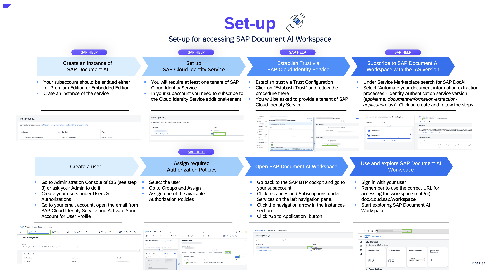
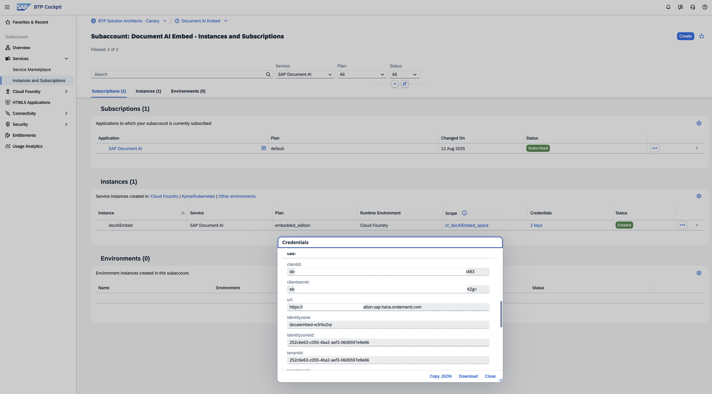
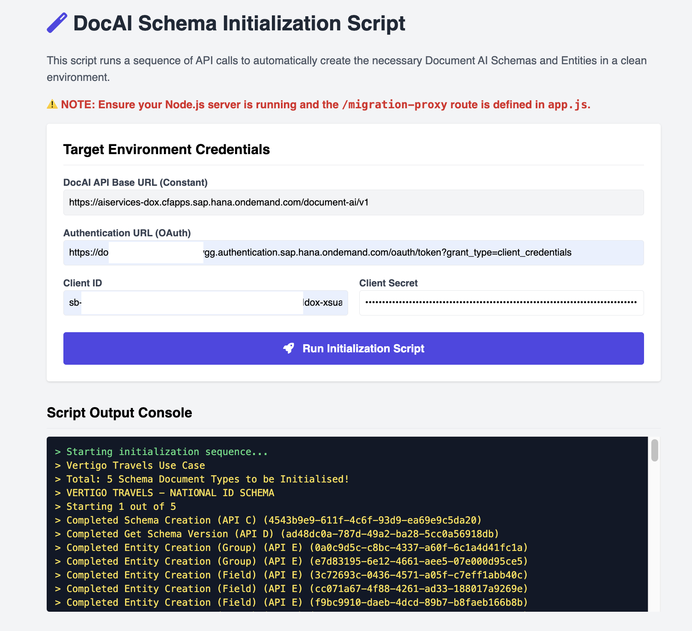
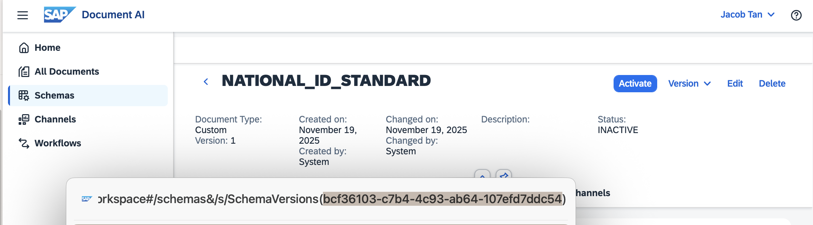
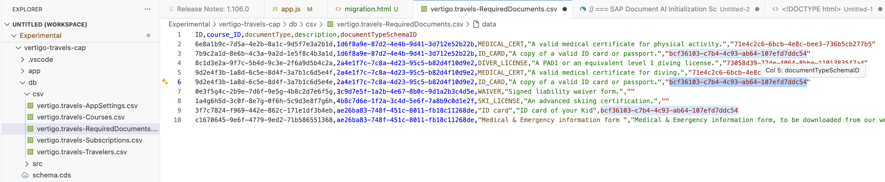

> [!NOTE]
> This documentation is currently under construction. Sections may be incomplete or subject to change.

# Vertigo Travels
### Streamline Document Processing with SAP Document AI: Jump Start Your Document Processing Use Case powered by Generative AI

This repository contains the full-stack prototype for **Vertigo Travels**, a travel agency use case built entirely on the SAP Business Technology Platform (BTP).

It serves as an end-to-end accelerator for partners and developers, demonstrating how to integrate **SAP Document AI**, **SAP Build Process Automation**, the **SAP Cloud Application Programming Model (CAP)**, and **SAP S/4HANA Cloud** into a single, cohesive application.

> [!WARNING]
> **Prototype & Support Disclaimer**
>
> This prototype serves as an inspiration for you to develop your own solution.
>
> We are not in a position to, and at our own discretion, will not maintain this repository. This version is published **as-is** without any guarantee of future updates or support.

### Table of Contents

1.  [Business Scenario](#1-business-scenario)
2.  [Solution Architecture](#2-solution-architecture)
3.  [Project Structure](#3-project-structure)
4.  [Deployment Strategy & Dependencies](#4-deployment-strategy--dependencies)

---

## 1. Business Scenario

The business process begins when a traveler, **Mary**, subscribes to a course on the Vertigo Travels website. This action triggers a BTP extension which creates a pre-subscription, collects her required documents (e.g., passport, ID card), and automatically processes them using **SAP Document AI**.

A back-office employee, **Barry**, uses a simple admin dashboard to review the *extracted data* from the documents. He can approve the subscription or, if documents are incomplete, trigger a validation workflow. If documents are missing, an **SAP Build Process Automation (BPA)** workflow is triggered to send automated email reminders to Mary.

Once Barry approves, the system automatically creates a Business Partner and Sales Order in **SAP S/4HANA Cloud**, finalizing the booking and payment process.

## 2. Solution Architecture

This solution is composed of several microservices and applications running on BTP. The frontend is a simple Node.js application that serves a static HTML page and acts as a proxy. This proxy communicates with a central **SAP CAP backend**, which in turn handles the core business logic and integration with other BTP services and S/4HANA Cloud.

## 3. Project Structure

This repository is a monorepo containing the following independent modules:

* **[`frontend-ui-nodejs/`](./frontend-ui-nodejs/)**
    Contains the simple Node.js Express application that serves the static HTML/CSS/JS frontend. It acts as a secure proxy to the backend CAP service, making it easy to swap this UI with any framework (SAPUI5, React, etc.). See the `README.MD` file within this folder for detailed instructions.

* **[`backend-data-cap/`](./backend-data-cap/)**
    The core of the application. This is an **SAP Cloud Application Programming Model (CAP)** project that defines the data model (Travelers, Courses, Subscriptions) and business logic. It is deployed on BTP, uses SAP HANA Cloud for persistence, and integrates with SAP S/4HANA Cloud via the Cloud SDK.

* **[`document-samples/`](./document-samples/)**
    Contains sample files (e.g., Passports, Identity Cards) filled with fictitious data. You can use these files to test uploads to SAP Document AI within the Vertigo Travels scenario without using sensitive real-world data.

* **[`backend-doc-synchroniser-nodejs/`](./backend-doc-synchroniser-nodejs/)**
    A simple, optional Node.js scheduler. This backend service periodically polls SAP Document AI to check for document status updates (e.g., 'confirmed') and synchronizes those statuses back to the main CAP data model.

* **[`bpa-doc-validation-flow-project/`](./bpa-doc-validation-flow-project/)**
    An optional **SAP Build Process Automation** project. It contains the 'Document Validation Flow' that is triggered by the 'Check' button in the admin UI. This demonstrates how to integrate BTP workflows into a custom application.

## 4. Deployment Strategy & Dependencies

To get this prototype up and running, modules and configurations must be executed in the specific order below.

### Step 1: Pre-requisites (SAP Document AI)

Before deploying any code, you must prepare your BTP Subaccount.

1.  **Create Service Instance:** Create an instance of the **SAP Document AI** service.
    * **Plan:** Ensure you select the **Premium Edition** or **Embedded Edition**.
    * **Interface:** Verify you have access to the modern `/workspace` interface and NOT the legacy `/ui` interface.
    * [Help: Initial Setup for SAP Document AI](https://help.sap.com/docs/document-information-extraction/document-information-extraction/enabling-service-in-cloud-foundry-environment?locale=en-US)
    * [Help: Subscribe to the Application](https://help.sap.com/docs/document-ai/sap-document-ai/what-is-sap-document-ai?locale=en-US)

    

    [Blog: Step by Step on Setting up SAP Document AI Embedding editioin & Workspace](https://community.sap.com/t5/technology-blog-posts-by-sap/initial-setup-of-sap-document-ai-embedded-edition-amp-workspace/ba-p/14248956)

2.  **Create Service Key:** Once the instance is created, generate a **Service Key**. You will need the credentials from this key (specifically `clientid`, `clientsecret`, and `url`) for subsequent steps.

    
    *(Above: Example of a successful Subscription, Service Instance and Service Key creation)*

### Step 2: Deploy Core (Mandatory) - `backend-data-cap`

This **must** be deployed first, as it is the data source for all other services.

* **Dependency:** This project currently has a hard dependency on an **SAP S/4HANA Cloud** tenant for creating Business Partners and Sales Orders.
* **Note:** We are working to remove this hard dependency to allow for standalone deployment by mocking S/4HANA calls.

### Step 3: Deploy Frontend (Mandatory) - `frontend-ui-nodejs`

Once the `backend-data-cap` service is deployed and its URL is known, you can deploy the frontend.

* **Configuration:** You must provide the CAP service URL (the `BACKEND_CDS_ENDPOINT`) and your Document AI Service Key credentials in the `manifest.yml` (for BTP) or `.env` (for local) file.
* **Instructions:** See the `frontend-ui-nodejs/README.MD` file for detailed instructions.

### Step 4: Initialize the Vertigo Use Case

Now that the frontend & NodeJs app is running, you **must initialize** the Document AI schemas. 

#### This step automates the creation of the 5 specific Vertigo Travels schemas and their entities.

1.  Navigate to the initialization page: `https://<YOUR_FRONTEND_URL>/initialisation.html`
2.  Insert the values from your **SAP Document AI Service Key** (OAuth Client Credentials).
3.  Click "Initialize". This will call the relevant APIs to set up your workspace.

    [**Click here to watch the Initialization Walkthrough Video**](https://youtu.be/pt8o4XPCT1M?si=kJnz1cytx1opgYOr)

    

### Step 5: Update Schema Configuration & Redeploy

Once initialization is complete, the system generates unique IDs for your schemas. You must link these IDs to your CAP data model.

1.  Retrieve the **Schema IDs** generated in Step 4, through your SAP Document AI workspace interface.

2.  Open your CAP project and locate the CSV data for the `requiredDocuments` entity (usually in `db/data`).

3.  Update the `schemaDocumentTypeID` column with the new IDs. This ensures that when a traveler uploads a document, the system knows exactly which schema to use for processing.

4.  **Redeploy** the `backend-data-cap` MTA project to apply these changes.
    

### Step 6: Optional Services

These services add functionality but are not required to run the basic application.

* **`bpa-doc-validation-flow-project` (Optional)**
    * **How it works:** If deployed, add its API Trigger URL to the `frontend-ui-nodejs` configuration (`BPA_WORKFLOW_URL`). This enables the "Check" button in the admin UI.
    * **If skipped:** The "Check" button can be ignored.

* **`backend-doc-synchroniser-nodejs` (Optional)**
    * **How it works:** Deploys as a standalone Node.js scheduler to sync statuses (e.g., 'confirmed', 'rejected') from Document AI back to your CAP app.
    * **If skipped:** Document statuses will remain as "Uploaded" or "Missing" and will not automatically sync.