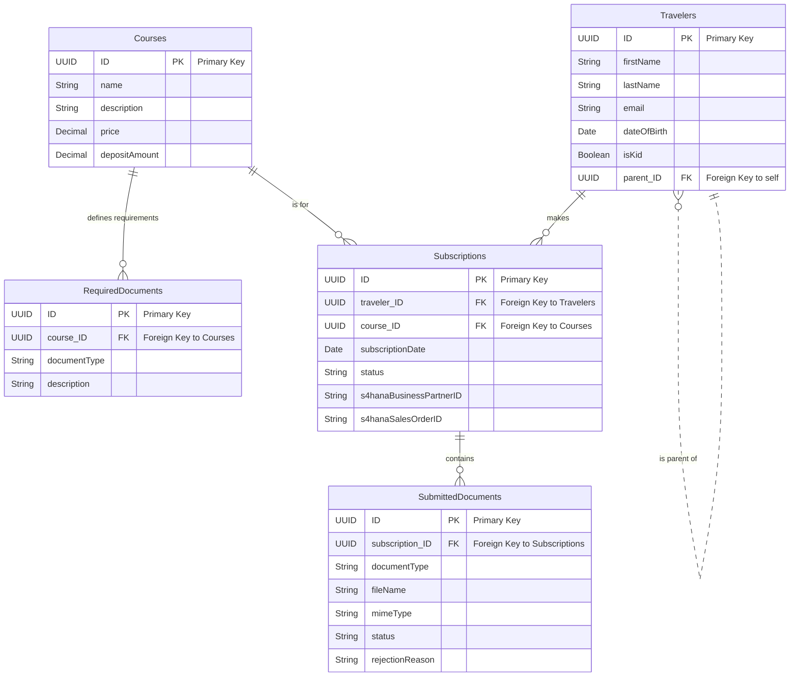

> [!NOTE]
> This documentation is currently under construction. Sections may be incomplete or subject to change.

# Vertigo Travels - CAP Backend Service

This folder contains the core backend service for the Vertigo Travels application, built using the **SAP Cloud Application Programming Model (CAP)**. It defines the data model, serves the business logic APIs, and handles integration with SAP HANA Cloud and SAP S/4HANA Cloud.

> [!WARNING]
> **Prototype & Support Disclaimer**
>
> This prototype serves as an inspiration for you to develop your own solution.
>
> We are not in a position to, and at our own discretion, will not maintain this repository. This version is published **as-is** without any guarantee of future updates or support.

### Table of Contents

1.  [Overview](#1-overview)
2.  [Data Model](#2-data-model)
3.  [Key Features](#2-key-features)
4.  [Local Development & Testing](#3-local-development--testing)
5.  [Production Deployment (SAP BTP)](#4-production-deployment-sap-btp)
6.  [Developer Info (How It Was Built)](#5-developer-info-how-it-was-built)

---

## 1. Overview

This CAP project is the "source of truth" for all data in the Vertigo Travels application.

* It defines the core **data entities** (like `Travelers`, `Courses`, and `Subscriptions`) in the `db/` folder.
* It exposes **OData services** (like `AdminService` and `s4-api`) in the `srv/` folder.
* It integrates with **SAP S/4HANA Cloud** using the Cloud SDK to create Business Partners and Sales Orders.
* It is designed to be deployed as a **Multi-Target Application (MTA)** to the SAP BTP, Cloud Foundry environment.

## 2. Data Model

This CAP project defines the core data model for the Vertigo Travels application. At a high level, it links Travelers to Courses via a Subscription, which in turn contains Submitted Documents.

Here is the visual Entity-Relationship Diagram:


> [!NOTE]
> For a detailed breakdown of each entity, its fields, and relationship logic, you can find the entity relationship diagram in the [`er-diagram.md`](./er-diagram.md) file to visualize the data model.

## 3. Key Features

* **Mock Data:** The `db/data/` folder contains sample `.csv` files (e.g., for `Courses`) that are automatically loaded into the SAP HANA database upon deployment, allowing you to test the application immediately.
* **API Testing:** The `test/` folder contains `.http` request files. You can use these with tools like the **VS Code REST Client** extension to easily test the OData APIs for various scenarios.
* **S/4HANA Integration:** This service communicates with S/4HANA Cloud to create master data (Business Partners) and transactional data (Sales Orders).

---

## 4. Local Development & Testing

You can run and test this CAP service locally before deploying it.

1.  **Install Dependencies:**
    ```bash
    npm install
    ```

2.  **Set Up Local Environment:**
    CAP's local runtime (`cds watch`) needs to simulate the BTP services (XSUAA and Destination) it depends on.
    * A sample file, `default-env_sample.json`, is provided in this repository.
    * **Copy this file and rename it to `default-env.json`**.
    * This file provides mock credentials for the XSUAA and Destination services, allowing the application to run locally.

3.  **Run Locally:**
    ```bash
    cds watch
    ```
    This command will start a local server (usually at `http://localhost:4004`), automatically reload on changes, and use an in-memory SQLite database.

4.  **Test with .http Files:**
    * Open the `.http` files in the `test/` folder.
    * If you have the **REST Client** extension for VS Code, you can click "Send Request" on any of the pre-built requests to test the local APIs.

---

## 5. Production Deployment (SAP BTP)

This application is designed to be deployed as an MTA to the Cloud Foundry environment.

### Prerequisites

* **Cloud Foundry:** Your BTP subaccount must have Cloud Foundry enabled and you must have a Space to deploy to.
* **SAP HANA Cloud:** You must have an SAP HANA Cloud instance available to bind to. The MTA will handle the HDI-container creation.
* **S/4HANA Destination:** You **must** create a Destination in your BTP subaccount.
    * **Name:** `VERTIGO_S4HC`
    * **Target:** This destination must point to your SAP S/4HANA Cloud tenant's OData API endpoint with the necessary authentication (e.g., Client ID/Secret or SAML Assertion).

### Deployment Steps

1.  **Install Dependencies:**
    ```bash
    npm install
    ```

2.  **Build CAP Project:**
    This compiles the CDS definitions into the `gen/` folder needed for deployment.
    ```bash
    cds build --production
    ```

3.  **Configure MTA Descriptor:**
    * A sample file, `mta_sample.yaml`, is provided.
    * **Copy this file and rename it to `mta.yaml`**.
    * Review the file. It defines the resources (like the XSUAA service, Destination service, and HANA database) and the modules to be deployed (the CAP service, DB deployer, and approuter). You should not need to modify it unless you change resource names.

4.  **Build MTA Archive:**
    This bundles your application into a deployable `.tar` file.
    ```bash
    mbt build -t gen --mtar mta.tar
    ```

5.  **Deploy to Cloud Foundry:**
    This command will deploy your application and create or bind all the services defined in your `mta.yaml`.
    ```bash
    cf deploy gen/mta.tar
    ```

---

## 6. Developer Info (How It Was Built)

This section provides a brief overview of the commands used to scaffold this project structure.

1.  **Add BTP Production Features:**
    This command adds the necessary configurations for HANA, MTA, XSUAA, and an Approuter for production deployment.
    ```bash
    cds add hana,mta,xsuaa,approuter --for production
    ```

2.  **Install Additional Dependencies:**
    These packages are used for the S/4HANA integration (via destination/passport) and to handle CORS (Cross-Origin Resource Sharing) for the UI.
    ```bash
    npm update --package-lock-only
    npm install cors
    npm install @sap/xsenv
    npm install passport
    ```