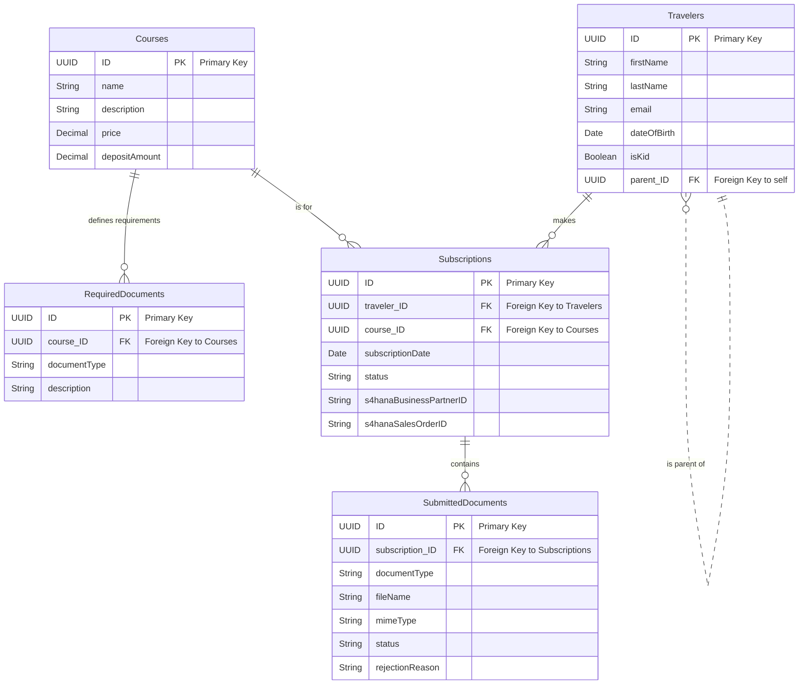

# Vertigo Travels Entity-Relationship Diagram

This diagram visualizes the data model for our application. 
It is generated from the CDS definitions.

# How to read the diagram:

||--o{ denotes a one-to-many relationship where the "one" side is mandatory (e.g., a Subscription must belong to one Traveler).

The text on the line (e.g., "makes") describes the relationship.

# Detailed Entity Fields

This document provides a breakdown of the fields for each entity in the data model.

---

### 1. Courses

This entity stores the details of the travel packages or courses offered to customers.

* **ID** (UUID): The unique identifier for each course.
* **name** (String): The name of the course (e.g., "Sailing Course Level 2").
* **description** (LargeString): A detailed description of the course's content and features.
* **price** (Decimal): The total price for the course.
* **depositAmount** (Decimal): The initial deposit required to secure a spot.
* **Standard Managed Fields**: This entity includes standard CAP-managed fields: `createdAt`, `createdBy`, `modifiedAt`, and `modifiedBy`.

---

### 2. RequiredDocuments

This entity defines the specific documents that are needed for each course.

* **ID** (UUID): The unique identifier for a document requirement entry.
* **course_ID** (UUID): A foreign key that links this requirement to a specific **Courses** entity.
* **documentType** (String): A code representing the type of document (e.g., `'ID_CARD'`, `'MEDICAL_CERT'`).
* **description** (String): A user-friendly explanation of the document needed.

---

### 3. Travelers

This entity holds information about the customers and any dependents they register.

* **ID** (UUID): The unique identifier for each traveler.
* **firstName** (String): The traveler's first name.
* **lastName** (String): The traveler's last name.
* **email** (String): The traveler's primary email address.
* **dateOfBirth** (Date): The traveler's date of birth.
* **isKid** (Boolean): A flag indicating if the traveler is a minor.
* **parent_ID** (UUID): A foreign key used to link a child traveler to a parent's record in this same entity.
* **Standard Managed Fields**: This entity includes standard CAP-managed fields: `createdAt`, `createdBy`, `modifiedAt`, and `modifiedBy`.

---

### 4. Subscriptions

This is the central transactional entity that links a **Traveler** to a **Course**.

* **ID** (UUID): The unique identifier for the subscription record.
* **traveler_ID** (UUID): A foreign key linking to the **Travelers** entity.
* **course_ID** (UUID): A foreign key linking to the **Courses** entity.
* **subscriptionDate** (Date): The date when the subscription was created.
* **status** (String): The current status of the subscription (e.g., `'Draft'`, `'DocsChecking'`, `'Confirmed'`).
* **s4hanaBusinessPartnerID** (String): Stores the Business Partner ID generated in SAP S/4HANA.
* **s4hanaSalesOrderID** (String): Stores the Sales Order ID from SAP S/4HANA.
* **Standard Managed Fields**: This entity includes standard CAP-managed fields: `createdAt`, `createdBy`, `modifiedAt`, and `modifiedBy`.

---

### 5. SubmittedDocuments

This entity stores records of the documents uploaded by a traveler as part of a **Subscription**.

* **ID** (UUID): The unique identifier for a submitted document record.
* **subscription_ID** (UUID): A foreign key linking to the **Subscriptions** entity.
* **documentType** (String): The specific type of document that was submitted.
* **fileName** (String): The original file name of the uploaded document.
* **mimeType** (String): The MIME type of the file (e.g., `'application/pdf'`).
* **content** (LargeBinary): The actual binary content of the file.
* **status** (String): The verification status of the document (e.g., `'Uploaded'`, `'Approved'`, `'Rejected'`).
* **extractedData** (LargeString): Stores JSON data extracted from the document by a service.
* **rejectionReason** (String): Provides a reason if the document was rejected during verification.